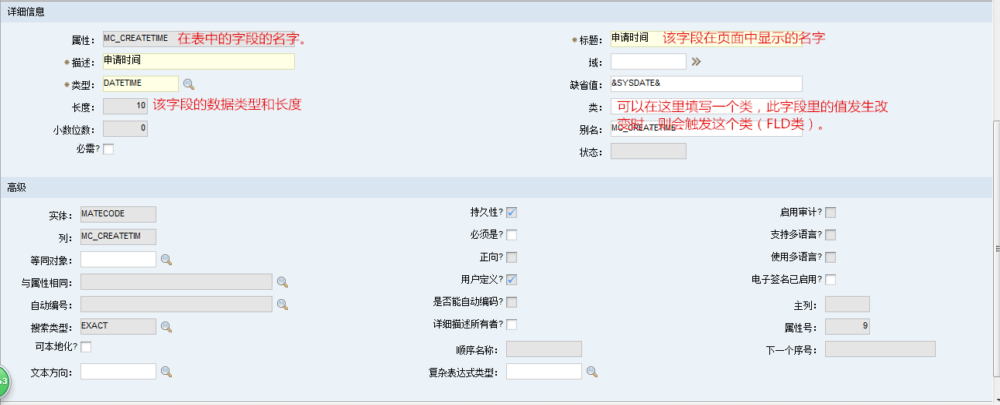

# 工作流

ORIGINATOR 特殊角色，工作流编写者
:&PERSONID&     :&SYSDATE& 特殊用法，获取当前登录人ID,USERNAME,SYSDATE。

请审批 :person.displayname 需求计划申请(:REQUIREPLANNUM :DESCRIPTION)
请修改被退回的需求计划(:REQUIREPLANNUM :DESCRIPTION)
    

连接线 -> 操作
创建操作里 的 对象 类型 访问位置 成员 

类型：变更状态 值：等待部门主任审批
改变需求计划申请单的状态值

状态的值 要 在数据库配置里 对应的对象，属性的域里添加然后选择

角色的创建
类型 对象  值 参数

需求部门经理审批

