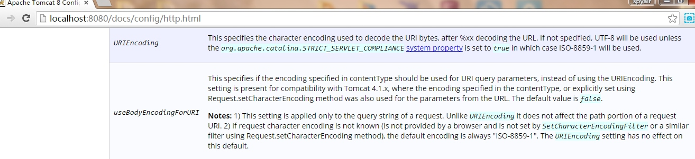

# 关于中文乱码

在JSP页面中输入中文，请求页面后不出现乱码：保证
`contentTYpe="text/html;charset=utf-8",pageEncoding="utf-8"`
charset和pageEncoding的编码一致，且都支持中文，通常建议取值为UTF-8，还需保证浏览器的现实字符编码也和请求的JSP页面的编码一致。
获取中文参数：tomcat6 get请求默认使用iso-8859-1,tomcat8 get请求默认使用utf-8


所以对于tomcat6
post请求：只要在请求信息(request.getParameter或者getReader)前调用request.setCharacterEncoding="utf-8"即可。
get请求：
```java
    String val = request.getParameter("username");
    String username = new String(val.getBytes("iso-8859-1"),"utf-8")
```
或者设置tomcat6的编码方式(server.xml文件中添加Connector节点的属性userBodyEncodingForURI="true")参照图中所示的文档。


# web应用里斜杠代表什么

若/交给servlet容器来处理这代表web应用的根路径，若交给浏览器处理则表示web站点的根路径
### 代表当前web应用的根目录localhost:8080/contentpath
*  请求转发时
 `request.getRequestDispatcher("/path/b.jsp").forward(request,response) `
* web.xml中映射servlet的路径的时候
* 各种定制标签的/
### 代表web站点的根路径 loaclhost:8080
* 超链接`<a href="/b.jsp" >to b page</a>`
* 表单中的action  `<form action="/servlet" method="post"></form>`
* 做请求重定向的时候 `response.sendRedirect("/path/b.jsp")`

# 防止表单重复提交

在表单页面生成一个随机值token，然后把这个值放入session中，并在表单下提供一个隐藏域放入token和其值。
在目标servlet中：获取session域中的token值，并和表单隐藏域中的值是否一致，若一致受理请求同时把session域中的token属性清楚，若不一直则直接响应提示页面重复提交。